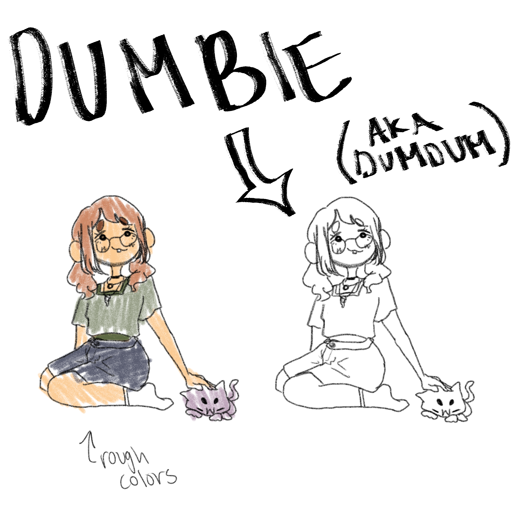
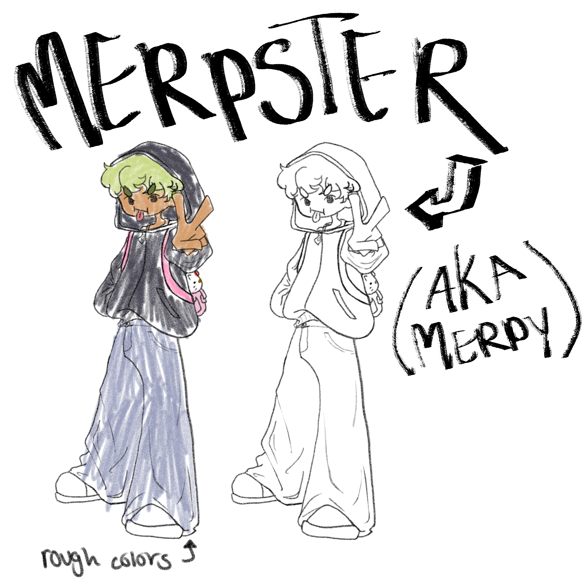

# **Fumblerz!**
Created by Julienne Madjus 
Contact Me! _<a class="u-email" href="mailto:juliennemadjuss@gmail.com">juliennemadjuss@gmail.com</a>_  
_<a href="https://www.tiktok.com/@eggzemah?_t=8g3ZnnvqBtW&_r=1">Other Art!</a>_ Currently in progress...
## **What is Fumblerz?**
This is a mini series that will follow the main characters and their different silly stories on how they fumbled! Watch as these characters explore their new curiosity towards love through their own various experiences.

As this is a fairly new concept I decided to play around with, there isn't much I have to show of it right now but I have a few characters and a few stories in my head that are bubbling! These may change a lot over the course of this semester!

I orginally came up with this idea as to recreate funny storytimes that me and my friends have experienced and wanted to share as silly little inside jokes!
## **Characters**
### Dumbie _(aka DumDum)_
_The dense no-good-at-love main character!_
- Hopeless Romantic
- Never gets the hint until after the fact!
- 17

 

 

### Merpster _(aka Merpy)_
_The bold no-good-at-love main character!_
- Hopeless Romantic
- Only falls for people who don't want them...
- 17

 

 

## **Episode/Story Ideas**
1. The Fumble of 23' :
_Dumbie goes to the arcade with Merpster and fumbles her ideal type!_
> - Dumbie and Merpster decide to go to an arcade
> - While playing a car racing game a stranger sits next to Dumbie and is clearly showing interest in her!
> - Once DumDum finally notices the stranger, her nerves explodes and she runs away, fumbling her ideal type
 

 
2. Fall of Fame :
_Merpster falls for a popular skater! Why do they seem so...familliar?_
> - Merpster gets the chance to talk to a popular skater while at a random skate park
> - He is Merpsters ideal type but shows no interest in Merpy at all
> - Merpy shoots their shot and absolutely misses at his response
> - Apparently Merpy turned him down in elementary and he was terribly heartbroken, having turned to skating to make them regret it, finding his own BF on the way
3. Brutal :
_Dumbie gets asked out to Homecoming! How does she respond?_
> - Dumbie's hallway crush starts talking to her after hanging out together for a bit through mutual friends
> - She's obviously giving Dumbie hints but DumDum thinks nothing of it, it's just girls being girls...right?
> - She ends up confessing to DumDum over text but she misunderstands her as she unknowingly turns her down! This causes her to avoid DumDum at all costs out of embarassment

